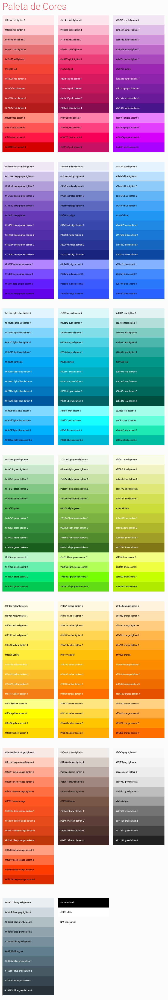

# WORKFLOW

## Páginas internas
### Categorias
- Contato
- Empresa/ Quem Somos
- Galeria de Fotos
- Produto / Servicos
- Depoimentos
- Videos
- Localizacao
- Agenda/ Eventos
- Perguntas Frequentes
- Orçamentos
- Links Úteis
- Clientes/ Parceiros
- Páginas com Formulário


## RESPONSIVE BS CAROUSEL v 2.0

Agora para ter o seu bootstrap carousel responsivo basta add a classe 'carousel-responsive' e add nos attrs **'data-md'**, **'data-sm'** e **'data-xs'** , a quantidade de itens que você queira mostrar para tal midia:

### Exemplo:

Um carousel com  4 itens no desktop, 3 no tablet e 1 no mobile

```
<div class="carousel carousel-responsive">
	<div class="carousel-inner">
		<div class="col-md-3 col-sm-4"> ... </div>
		<div class="col-md-3 col-sm-4"> ... </div>
		<div class="col-md-3 col-sm-4"> ... </div>
		<div class="col-md-3 col-sm-4"> ... </div>
	</div>
</div>
```

**OBS:**
- Os attrs **'data-md'**, **'data-sm'** e **'data-xs'** carregam consigo como valor default 1.
- É **OBRIGATÓRIO** a atribuição de um **'id'** para o carousel, caso o constrário, o mesmo **não** funcionará.

# Bootstrap

Foi-se migrado da versão 3 para a 4. Para maiores informações, acesse http://getbootstrap.com/

# YARN

Foi-se migrado do npm para yarn, que é outro gerenciador de dependências like a npm, no entanto é mais rápido e também funciona offline.

Para mais informações sobre o yarn, acesse https://yarnpkg.com/

# MATERIAL DESIGN Colors

Foi adicionado a palheta de cores utilizados pelo Google Material Design!
Para poder utilizar é muito simples! Veja no exemplo abaixo:

```
<style>
	.box-red-lighten-3{
		background: materialColor("red", "lighten-3"); /* #EF9A9A */
	}

	/* Caso queira a cor "central" */

	.box-red{
		background: materialColor("red", "red"); /* #F44336 */
	}
</style>
```

Viu só ;D

Basta usar os codnomes listados na imagem abaixo que é show!

